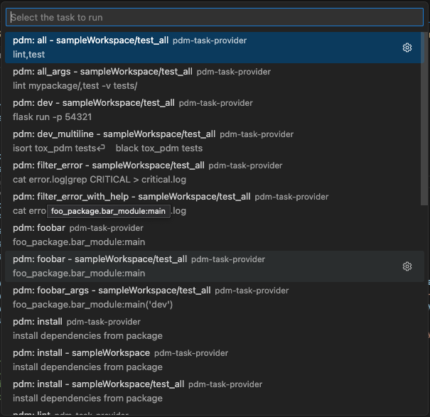
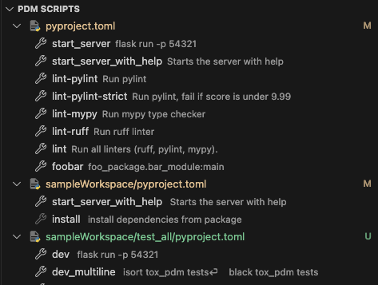
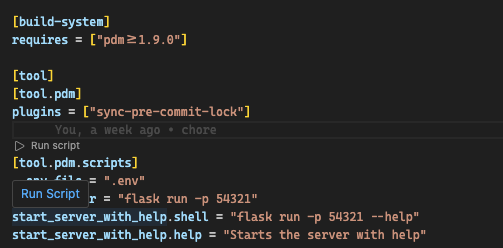

# [PyProject Pilot - PPP](https://marketplace.visualstudio.com/items?itemName=gabdug.pdm)


Work with PDM scripts as VS Code tasks, and run them directly from `pyproject.toml` files.

You need to have [PDM Scripts](https://pdm-project.org/latest/usage/scripts/) (`[tool.project.scripts]`) or [executable projects scripts](https://packaging.python.org/en/latest/guides/writing-pyproject-toml/#creating-executable-scripts) (`[project.scripts]`) defined in your `pyproject.toml` file for this extension to work:

```toml pyproject.toml
[tool.pdm.scripts]
start = "flask run -p 54321"
lint = "flake8"
test.cmd = "pytest"
test.help = "Launch pytest"

[project.scripts]
"my-app" = "my_app:main"
```

## Features

### Task Running

This extension supports running pdm scripts defined in `pyproject.toml` files as [tasks](https://code.visualstudio.com/docs/editor/tasks).

To run scripts as tasks, use the **Tasks** menu.

For more information about auto detection of Tasks, see the [documentation](https://code.visualstudio.com/Docs/editor/tasks#_task-autodetection).



### Script Explorer

The PDM Script Explorer shows the pdm scripts found in your workspace. The explorer view is enabled by the setting `pdm.enableScriptExplorer`. A script can be opened or ran, from the explorer.



### Run Scripts from the Editor

The extension supports to run the selected script as a task when editing the `pyproject.toml` file. You can either run a script from
the hover shown on a script or using the command `Run Selected PDM Script`.



### Run Scripts from a Folder in the Explorer

The extension supports running a script as a task from a folder in the Explorer. The command `Run PDM Script in Folder...` shown in the Explorer context menu finds all scripts in `pyproject.toml` files that are contained in this folder. You can then select the script to be executed as a task from the resulting list. You enable this support with the `pdm.runScriptFromFolder` which is `false` by default.

### Workspace-aware

This extension should support [multi-root workspaces](https://code.visualstudio.com/docs/editor/multi-root-workspaces), and will run scripts in the folder of the file that is currently active.

Multiple `pyproject.toml` files are supported, and scripts are detected in all of them: you should be able to use this extension in a monorepo.

> [!NOTE]
> This extension won't be active if your only open a file. You must always open a folder or workspace.


## Settings

- `pdm.autoDetect` - Enable detecting scripts as tasks, the default is `on`.
- `pdm.runQuiet` - Run pdm script with the `--quiet` option, the default is `false`.
- `pdm.packageManager` - The package manager used to run the scripts: `auto`, `pdm`. The default is `auto`, which detects your package manager based on files in your workspace.
- `pdm.exclude` - Glob patterns for folders that should be excluded from automatic script detection. The pattern is matched against the **absolute path** of the package.json. For example, to exclude all test folders use '\*\*/test/\*\*'.
- `pdm.enableScriptExplorer` - Enable the explorer view for PDM scripts.
- `pdm.scriptExplorerAction` - The default click action: `open` or `run`, the default is `open`.
- `pdm.enableRunFromFolder` - Enable running PDM scripts from the context menu of folders in Explorer, the default is `false`.
- `pdm.scriptCodeLens.enable` - Enable/disable the code lenses to run a script, the default is `false`.

## TODO

- Clean REPO
- Implement best practices from https://github.com/microsoft/vscode-python-tools-extension-template/blob/main/src/extension.ts
- Load project.scripts properly
- Show project.scripts on hover / selection?

## Next steps / ideas

_In no particular order. Feel free to contribute!_

### Tasks / Run

- [X] Setting for custom PDM interpreter path
- [X] Support for `help` arguments in `pdm.scripts`?
- Expose `pdm` commands as tasks (install, update, build, ...)
  - [ ] build: only if `[build-system]` is set
  - [ ] install plugins: only if `[tool.pdm.plugins]` is set
  - update/install/sync: only if `[project.dependencies]` is set or `[tool.pdm.dev-dependencies]` is set
- Expose `project.scripts` as debug tasks (or launch configurations?)
- [X] CodeLens on `plugins` to install them automatically
- Support `poethepoet` with Poetry?
- Improve ergonomics of the PDM Scripts Explorer
- Choose whether to run PDM scripts as tasks, or in the terminal
- Support dynamic project.scripts

### Dependency Management

- Hover information on dependencies (locked version, installed version, latest version, description...), akin to [this extension](https://marketplace.visualstudio.com/items?itemName=patrick91.python-dependencies-vscode)
   - In `pyproject.toml`
   - In `pdm.lock`
   - Information pulled from lockfile
   - Information pulled from Package Manager
   - Information pulled from Pypi
   - Setting to enable/disable each source (e.g. disable Pypi to avoid network requests)
   - Goto lockfile item / go to pyproject.toml item
   - Goto Pypi page
   - List of transitive dependencies / dependents
- Inlay hints on dependencies (locked/installed/latest version mismatch...)


### QA and Misc

- Writing some tests?
  - Fix coverage
- ~~Support for VS Code in browser?~~
- Cache tasks/`pyproject.toml` with [workspaceState](https://code.visualstudio.com/api/references/vscode-api#ExtensionContext.workspaceState)?
- Support `*.pyproject.toml` file pattern?
- Support internationalization (translations) with [@vscode-nls](https://www.npmjs.com/package/vscode-nls)
- Exclude some pyproject.toml files from auto detection (e.g. in `venv`, `.pdm-build` folders)
- Add (privacy-respecting) telemetry ([lib](https://github.com/microsoft/vscode-extension-telemetry/tree/main), [implementation example](https://github.com/microsoft/vscode-python/tree/main/src/client/telemetry))
- Dynamically generate the `package.json` VS Code Extension manifest
- Dynamically generate the README options.

## Recommended extensions

We recommend [Even Better TOML](https://marketplace.visualstudio.com/items?itemName=tamasfe.even-better-toml), which will also validate `pyproject.toml` and `pdm.toml` files.

## Credits

This project is based on the [built-in VS Code NPM extension](https://github.com/microsoft/vscode/tree/main/extensions/npm), published by Microsoft, released under MIT license.

Inspired by [PDM Task Provider VS Code Extensions by KnowSuchAgency](https://marketplace.visualstudio.com/items?itemName=knowsuchagency.pdm-task-provider).

The PDM logo is released under MIT license by frostming.

This extension uses many dependencies, but special thanks to @ota-meshi for [toml-eslint-parser](https://github.com/ota-meshi/toml-eslint-parser/tree/main).
